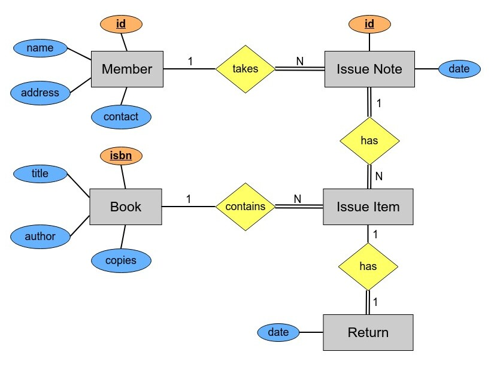

# Library Management System Spring Boot Back End 

This project began as a **monolithic design**, and subsequently an **n-tier architecture** was used to further develop the project with 
the **Jakarta Servlet 5.0** and **Apache Tomcat 10.1.1** technologies. This developed project can be visited by clicking [**here.**](https://github.com/PubuduJ/library-management-system-back-end)

This is the improved **Spring Boot 3.0.5 version** of the library management system and web services are exposed as 
APIs under the **members**, **books**, **issue-notes** and **returns** resources in this project.

More information on the exposed web services with example test cases can be found in the 
API documentations listed below.
- [**Members API documentation**](https://documenter.getpostman.com/view/25306703/2s8ZDa224j)
- [**Books API documentation**](https://documenter.getpostman.com/view/25306703/2s8ZDa229D)
- [**Issue-Notes API documentation**](https://documenter.getpostman.com/view/25306703/2s8ZDa2M6F)
- [**Returns API documentation**](https://documenter.getpostman.com/view/25306703/2s8ZDa2MEy)

#### Highlighted features of the application,
- Members are registered to the system by [**UUID**](https://en.wikipedia.org/wiki/Universally_unique_identifier), and no two members can have the same contact number.
- Books are registered to the system by international standard book number (isbn).
- When members take books from the library they will receive an issue note.
- The issue note contains all the take away book ISBNs along with the member UUID.
- All issue notes have unique issue id to uniquely identify them when the books are returned.
- Issue note can only have maximum 3 distinct ISBNs.
- A member cannot take the same book from the system twice at the same time or at two different times (with another issue note).
- A member can only take maximum of 3 different books from the system. If he/she needs another, he/she must return a book that he/she already got.

In this project, the **controller layer, service layer, utility classes, and advice layer** were all tested in the test directory.

#### ERD of the database

## Used Technologies

- Java SE 17
- Spring Boot 3.0.5
- Apache Maven 3.8.6
- MySQL Community Server 8.0.33
- Added dependencies to pom.xml
    - spring-boot-starter-web
    - spring-boot-starter-data-jpa
    - spring-boot-starter-validation
    - spring-boot-starter-aop
    - lombok
    - mysql-connector-java 8.0.33
    - springdoc-openapi-starter-webmvc-ui 2.0.4
    - modelmapper 3.1.0
    - spring-boot-devtools
    - spring-boot-starter-test

#### Used Integrated Development Environment
- IntelliJ IDEA

## How to use ?
This project can be used by cloning the 
project to your local computer.

Make sure to create a **lms-db** database in the MySQL community server and add all the insert queries from the **lms-db.sql** file to it.
If neglect to create the **lms-db** database, the project will automatically generate it when it is firstly executed.
You can find the lms-db.sql for this project under the **src -> main -> resources** directory.

#### Clone this repository
1. Clone the project using `https://github.com/PubuduJ/library-management-system-spring-boot-back-end.git` terminal command.
2. Open the `pom.xml` file from **IntelliJ IDEA**, make sure to open this as a project.
3. Change the `spring.datasource.password` in the `application.properties` to your local machine MySQL server `root` user password.

## Version
v1.0.0

## License
Copyright &copy; 2023 [Pubudu Janith](https://www.linkedin.com/in/pubudujanith94/). All Rights Reserved. 
This project is licensed under the [MIT license](LICENSE.txt).